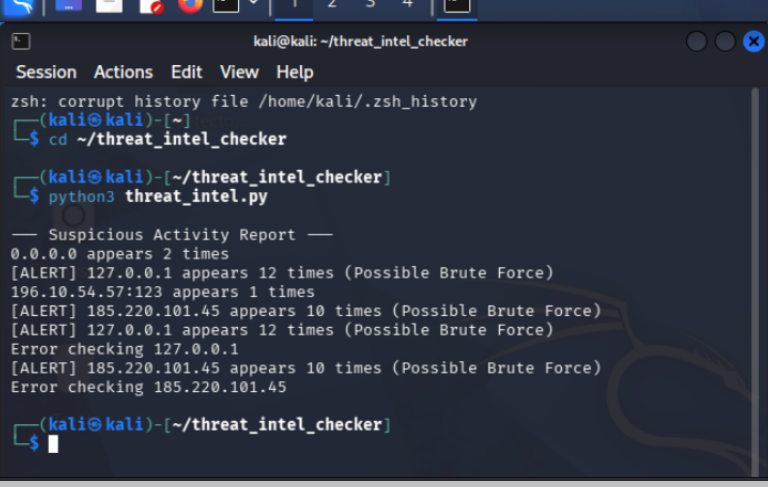
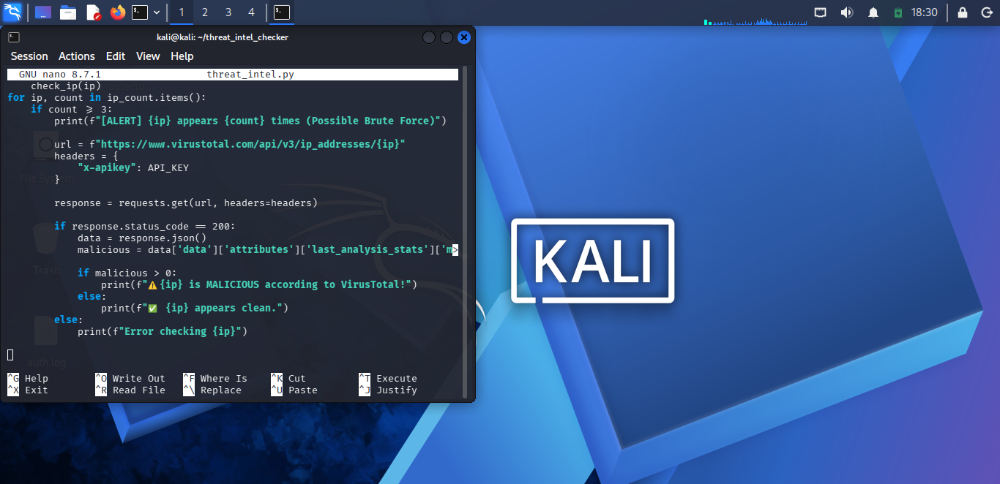

# threat-intelligence-ip-checker-
## 🚨 Project Objective

Simulate a SOC analyst workflow by detecting brute-force login attempts and enriching suspicious IP addresses using threat intelligence (VirusTotal API).
SOC project: Detect brute force attacks and enrich IPs using VirusTotal threat intelligence 
🔍 Threat Intelligence IP Checker (SOC Project)

📌 Overview

This project simulates a real-world SOC (Security Operations Center) workflow by detecting suspicious login activity from system logs and enriching IP addresses using threat intelligence.

The script analyzes authentication logs to identify brute-force attempts and verifies whether the detected IPs are malicious using VirusTotal.

---

🚨 Features

- Detects repeated login attempts (Brute Force detection)
- Extracts and counts IP addresses from log files
- Flags suspicious activity based on frequency
- Integrates with VirusTotal API for threat intelligence
- Identifies malicious IP addresses
- Generates a clear security report

---

🛠️ Technologies Used

- Python
- Linux (Kali)
- Regex (IP validation)
- VirusTotal API
- Log Analysis

---

📂 Project Structure

threat-intelligence-ip-checker/
├── threat_intel.py
├── auth.log
├── screenshots/
└── README.md

---

▶️ How to Run

1. Open terminal in project directory
2. Run:

python3 threat_intel.py

---

📸 Screenshots

## 📸 Detection Output

## 💻 Code Implementation

---

🎯 Key Learning Outcomes

- Practical SOC log analysis
- Threat detection using Python
- API integration for threat intelligence
- Identifying malicious IP behavior

---

## 📊 Threat Intelligence Insight: CVE-2026-3854

**Summary:**  
A critical Remote Code Execution (RCE) vulnerability in GitHub’s internal Git infrastructure allowed attackers to execute arbitrary commands via crafted `git push` operations.

**Key Technical Points:**
- Injection via `git push -o` options  
- Exploitation of internal `X-Stat` header  
- Sandbox bypass through environment manipulation  

**SOC Detection Opportunities:**
- Monitor unusual git push options  
- Detect abnormal hook execution  
- Alert on unexpected backend behavior  

**Lesson Learned:**  
Never trust user-controlled input—even in internal systems.

⚠️ Note

Replace the API key with your own VirusTotal API key before running the script:

API_KEY = "YOUR_API_KEY_HERE"

---

👨‍💻 Author

Tinashe Zacariah
Aspiring SOC Analyst | Cybersecurity Enthusiast
